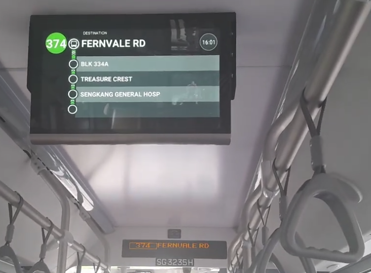

train-progress
==============

display a vehicle progress on a overhead screen for onboard passengers

a MQTT broker is the one input sources

a few topics will be listened to:

 * lineId: almost-number id of the route
 * colour: the colour theme of this route on the network map
 * theoricStops: the theoric line route
 * travelStops: the actual route if there are streetworks...
 * currentStop: one stop on this route

